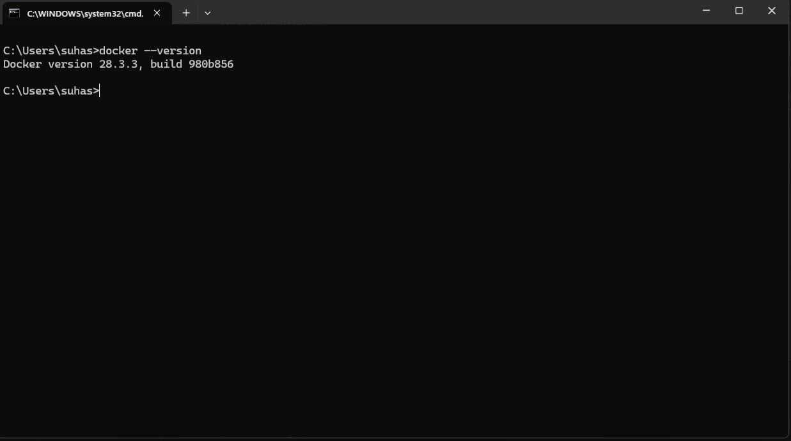

# Day 1: Docker Installation & Setup

## 📅 Date: __________

## 🎯 Objectives
- Install Docker
- Verify installation
- Understand Docker architecture

## 📝 Notes
[Your learning notes here]

## ✅ Tasks Completed
- [✅] Downloaded Docker Desktop
- [✅] Installed Docker
- [✅] Ran hello-world container
- [✅] Verified installation

## 💻 Commands Practiced
```bash
docker --version
docker run hello-world
docker ps
```

## 🐛 Issues Encountered
[C:\Users\suhas>docker run hello-world
docker: error during connect: Head "http://%2F%2F.%2Fpipe%2FdockerDesktopLinuxEngine/_ping": open //./pipe/dockerDesktopLinuxEngine: The system cannot find the file specified.

Run 'docker run --help' for more information]

## 💡 Solutions Found
[How you solved them]

## 📸 Screenshots
[]

## 🔗 References
- [Link to helpful resource 1]
- [Link to helpful resource 2]

## ⏭️ Next Steps
Tomorrow: Basic Docker Commands